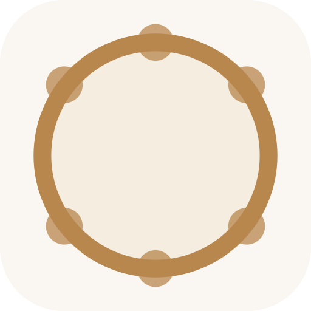
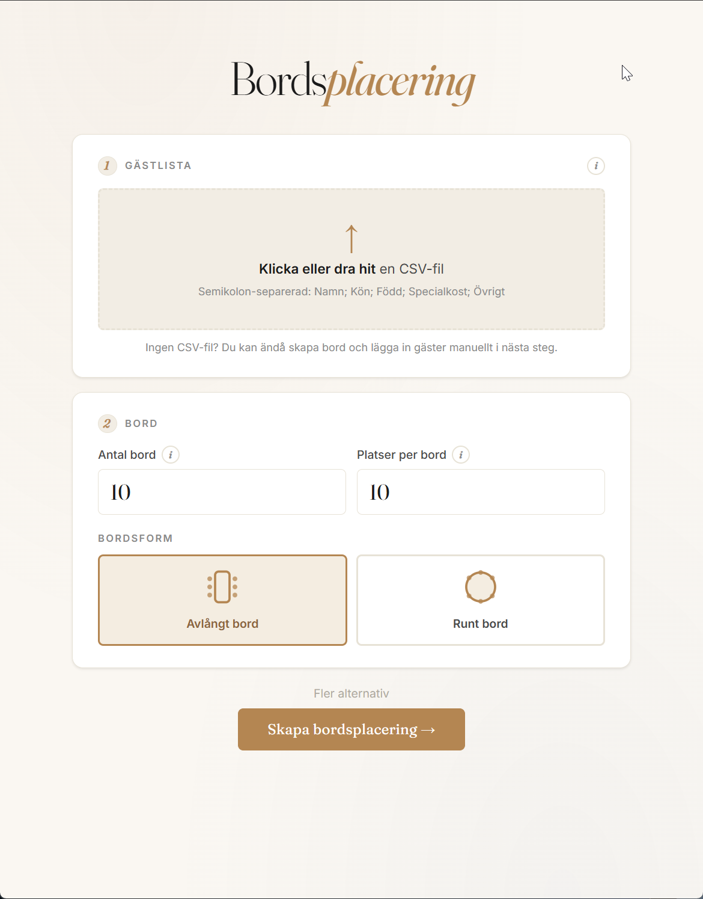
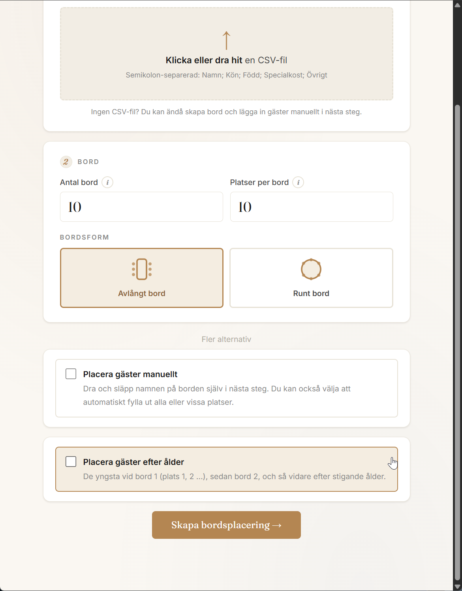
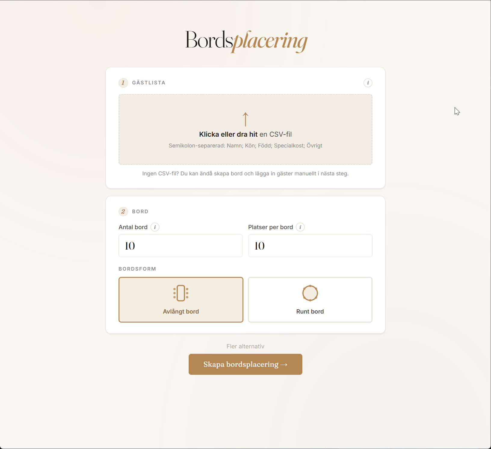
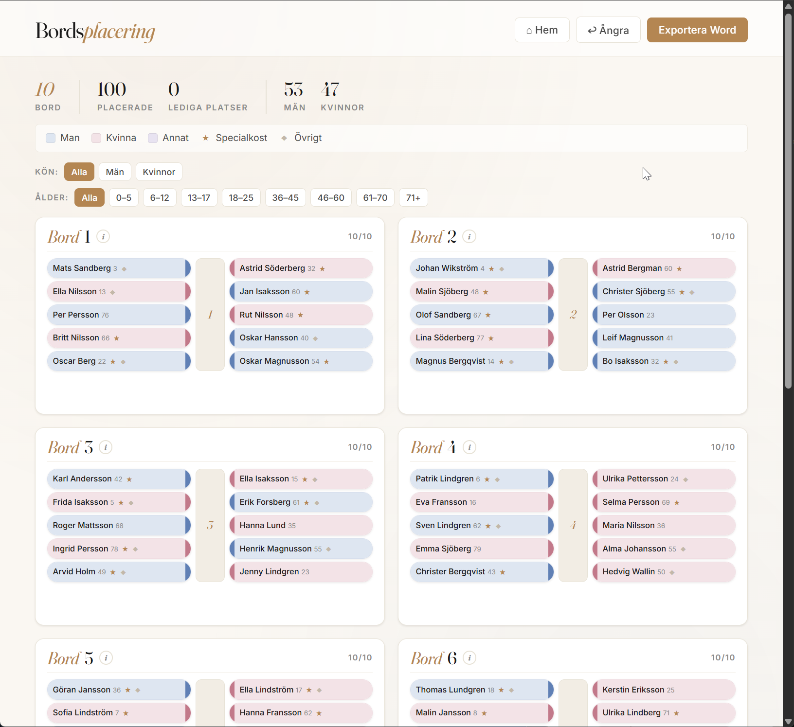
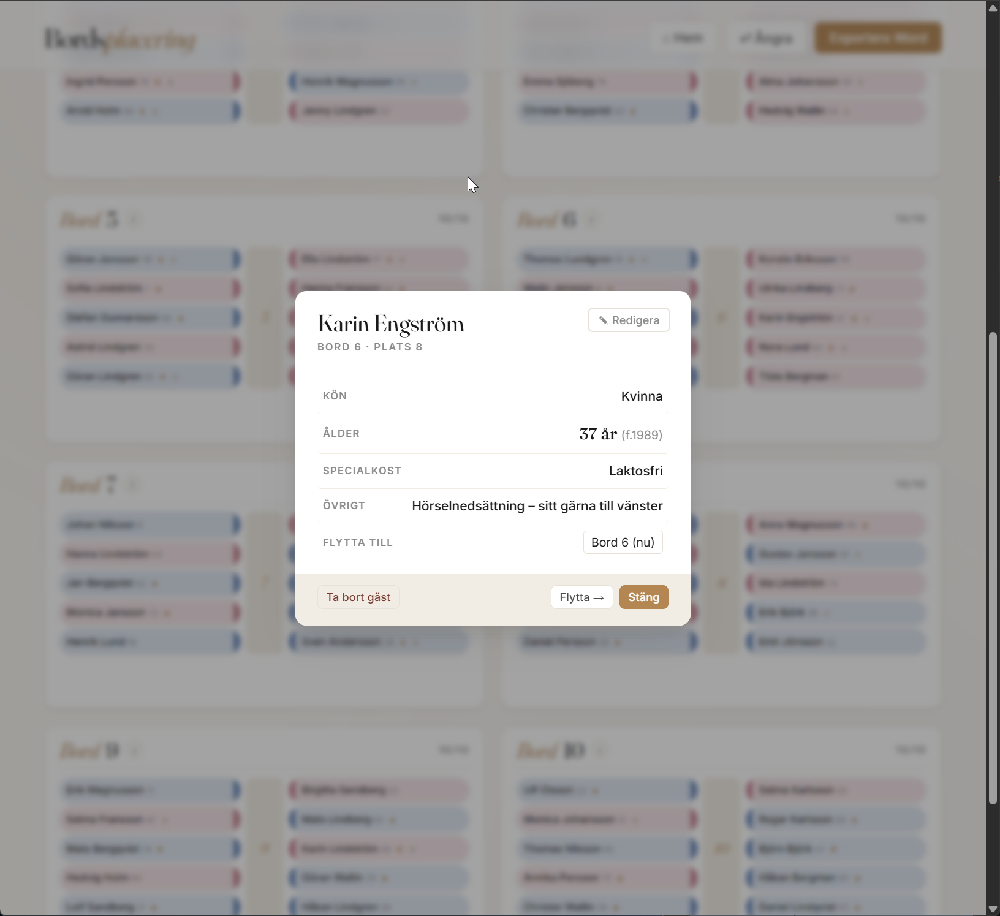
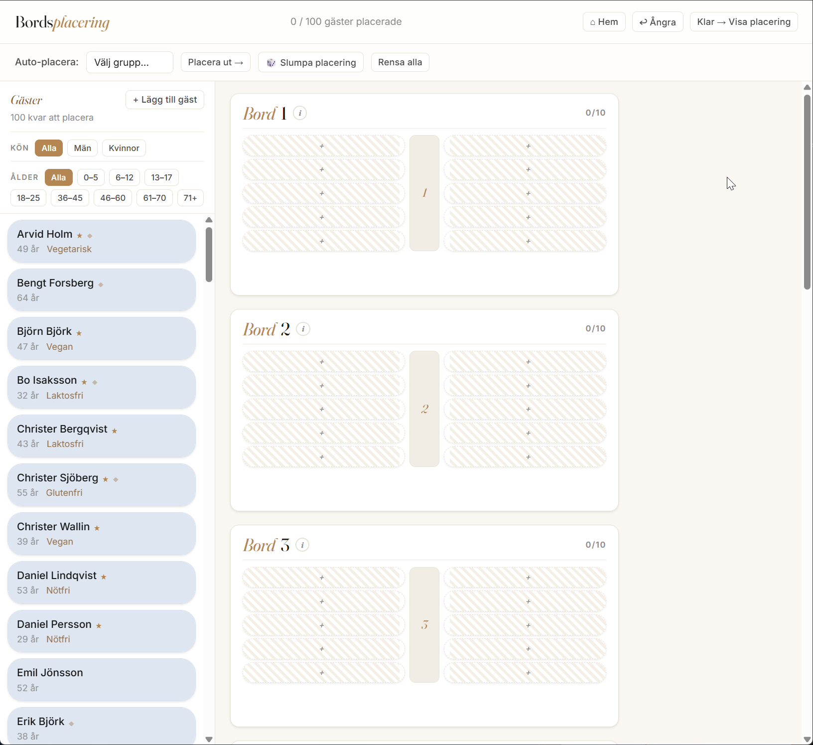

<p align="center">
  
</p>

# Bordsplacering

Webbapp för att planera bordsplacering vid middagar och evenemang — importera gäster från CSV, skapa bord och placera automatiskt eller manuellt.

**App:** [https://delit.github.io/bordsplacering/](https://delit.github.io/bordsplacering/)

<p>
  
  
</p>
<p>
  
  
  
  
</p>

## Funktioner

- Importera gästlista från CSV (semikolon-separerad)
- Testa eller ladda ned exempeldata (100 gäster) direkt i appen
- Skapa bord (avlångt eller runt), auto-placering eller manuellt läge
- Filtrera på kön och ålder
- Fält för specialkost och övrigt (med ikoner i gränssnittet)
- Exportera placering till Word
- Autospar i webbläsaren (localStorage)

## CSV-format

```text
Namn;Kön;Född;Specialkost;Övrigt
```

| Kolumn | Beskrivning |
|--------|-------------|
| Namn | För- och efternamn |
| Kön | Man, Kvinna eller Annat |
| Född | Födelseår (t.ex. 1978) |
| Specialkost | Valfritt (glutenfri, vegetarisk, …) |
| Övrigt | Valfri fri text (ej matrelaterat) |

Exempelfil: [`exempel_gaster.csv`](exempel_gaster.csv)

## Filer

| Fil | Innehåll |
|-----|----------|
| `index.html` | Huvudsida |
| `bordsplacering.css` | Stilar |
| `bordsplacering.js` | Logik |
| `exempel_gaster.csv` | Exempelgäster |
| `favicons/` | Ikoner (16–512 px, SVG, ICO, manifest) |
| `img/` | Skärmdumpar till README |

## Licens

Projektet tillhör [delit](https://github.com/delit) på GitHub.
